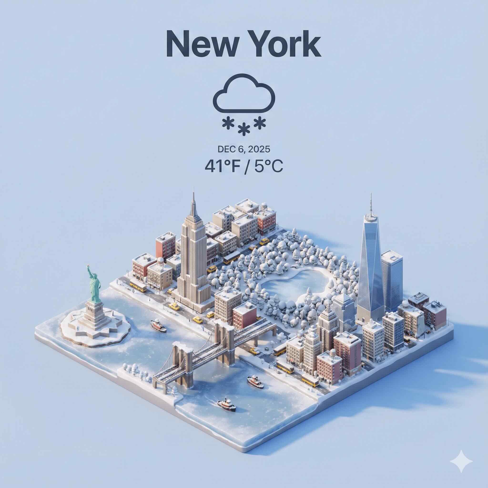

Present a clear, 45° top-down isometric miniature 3D cartoon scene of New York City, featuring its most iconic landmarks and architectural elements.
Use soft, refined textures with realistic PBR materials and gentle, lifelike lighting and shadows. Integrate the current weather conditions directly into the city environment to create an immersive atmospheric mood.
Use a clean, minimalistic composition with a soft, solid-colored background. At the top-center, place the title "New York" in large bold text, a prominent weather icon beneath it, then the date (small text) and temperature (medium text).

